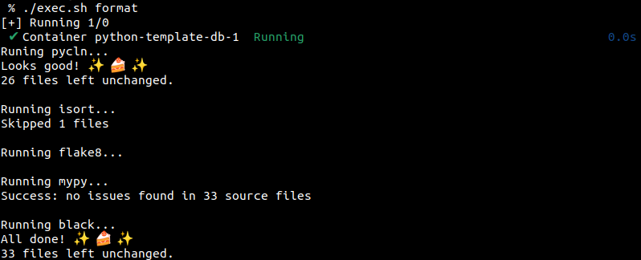
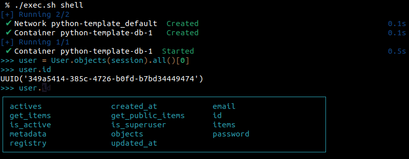
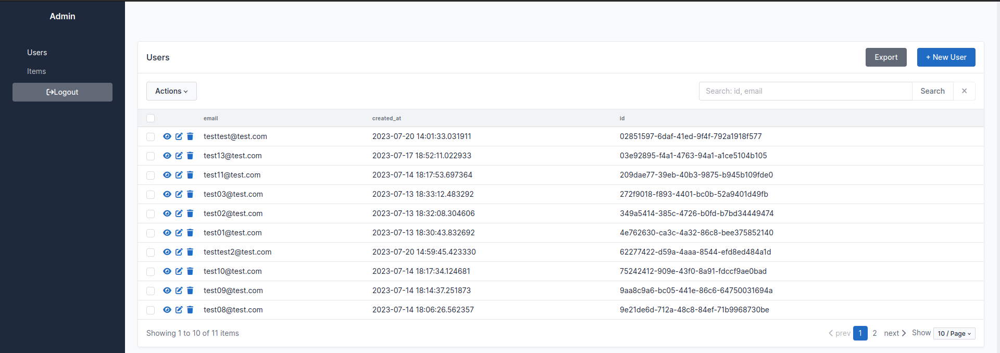

# Python Template

## Components
- Rest API built with FastAPI and SQLAlchemy
- PostgreSQL database

## Project setup
You only need to install [Docker](https://docs.docker.com/engine/install/) and [Docker Compose](https://docs.docker.com/compose/install/). 
To start the containers, just run `docker-compose up` (or `docker-compose up -d` if you want to run the containers in background); or `docker-compose create` and `docker-compose start` if you don't want to see the logs. 
Once the containers are running, you can go to `http://localhost:8000/docs` to see the automatic interactive API documentation.

## Migrations
We use Alembic as database migration tool. To run its commands you can open an interactive shell inside the backend container (you can use `./exec.sh bash` shortcut), or use the following shortcuts under the `/scripts` directory:
- `./exec.sh migrate` -> runs all the migrations
- `./exec.sh makemigrations` -> compares the actual status of the DB against the table metadata, and generates the migrations based on the comparison

## Code tools
Linters, formatters, etc.

- **Pycln**: Formatter for finding and removing unused import statements.
- **isort**: Tool to sort imports alphabetically and automatically separate into sections by type.
- **flake8**: Linting tool
- **mypy**: Static type checker
- **black**: PEP 8 compliant opinionated formatter

There is a shortcut under the `/scripts` directory that runs all this tools for you (`./exec.sh format`).

## Tests
We use FastAPI's `TestClient` and `pytest` for testing. `./exec.sh test` shortcut can be used to run all tests.

## Shell
There is a shortcut under the `/scripts` directory that opens a python interactive shell inside the docker container. It's `./exec.sh shell` and has some useful pre-imported stuff:

- `session`: A SQLAlchemy `Session` object
- `settings`: An instance of the app settings class
- All the SQLAlchemy models classes

## Admin
The template includes an admin interface via [SQLAdmin](https://github.com/aminalaee/sqladmin). It's a flexible admin that can be configured in many ways. One note: it's not recommended to include relationships in the `column_list`, because it's not very optimal in terms of DB requests in those cases.

